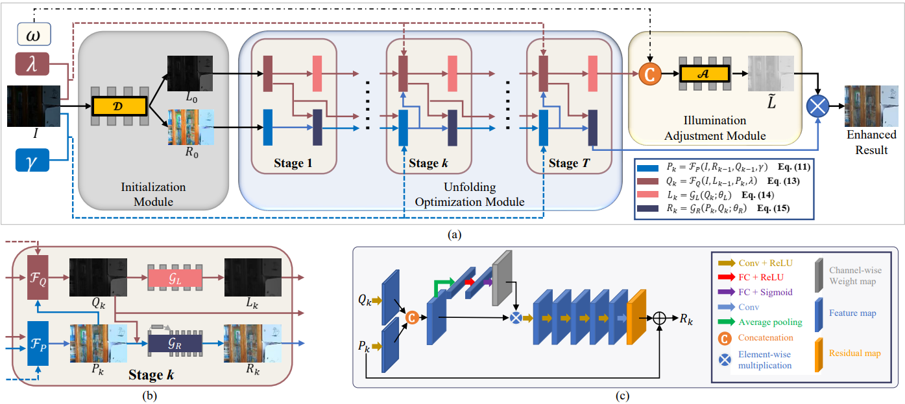

# Deployment Steps for the URetinex-Net Model  

Welcome to URetinex-Net! Below are the steps to deploy and use this model for low-light image enhancement.  
You can quickly access the results after deployment at: https://huggingface.co/docs/hub/spaces-config-reference  

---  

# News: enhanced version has been released!
See [URetinex-Net++](https://github.com/AndersonYong/URetinex-Net-PLUS). We release training code of URetinex-Net++, which share the decomposition module and unfolding module with URetinex-Net, enjoy!

# URetinex-Net: Retinex-based Deep Unfolding Network for Low-light-Image-Enhancement
Official PyTorch implementation of URetinex-Net: Retinex-based Deep Unfolding Network for Low-light-Image-Enhancement in CVPR 2022.



[[Paper]](https://openaccess.thecvf.com/content/CVPR2022/papers/Wu_URetinex-Net_Retinex-Based_Deep_Unfolding_Network_for_Low-Light_Image_Enhancement_CVPR_2022_paper.pdf)
[[Supplementary]](https://openaccess.thecvf.com/content/CVPR2022/supplemental/Wu_URetinex-Net_Retinex-Based_Deep_CVPR_2022_supplemental.pdf)
[[Video]](https://www.youtube.com/watch?v=MJZ5HT1jGrA)

## Environment Requirements  
Please ensure your environment meets the following requirements:  
1. python==3.8.20  
2. PyTorch == 2.4.1  
3. torchvision == 0.20.0  
4. torchsummary==1.5.1  
5. numpy==1.24.4  
6. opencv_python==4.11.0.86  
7. Pillow==11.1.0  
8. streamlit==1.40.1  

## Deployment Steps  

### 1. Clone the Project  
First, you need to clone the project code to your local machine:  
```bash  
git clone https://github.com/JackPeng-0311/URetinex-Net-003.git  
cd URetinex-Net-003-main
```
### 2. Install Dependencies
Next, use the pip command to install the necessary dependencies for the project:
```bash  
pip install -r requirements.txt
```
### 3. Prepare Data
Please prepare your data images and place the images you want to process in the .demo/input/ directory.

### 4. Run the Code
Deploy the code using Streamlit for testing:
```bash  
streamlit run app.py
```
### 5. Test and Validate Results  
After completing the deployment, you can test and validate the image enhancement effects by following these steps:  
1. **Upload Test Image:**  
   In the Streamlit application interface, you can choose the image you want to enhance via the file upload feature.  

2. **Run the Application:**  
   After uploading the image, the model will automatically start processing the image.  

3. **View Results:**  
   The enhanced image will be displayed in the interface, allowing you to compare it with the original image. You can also use a slider to quickly adjust the enhancement ratio to achieve different levels of enhancement.
